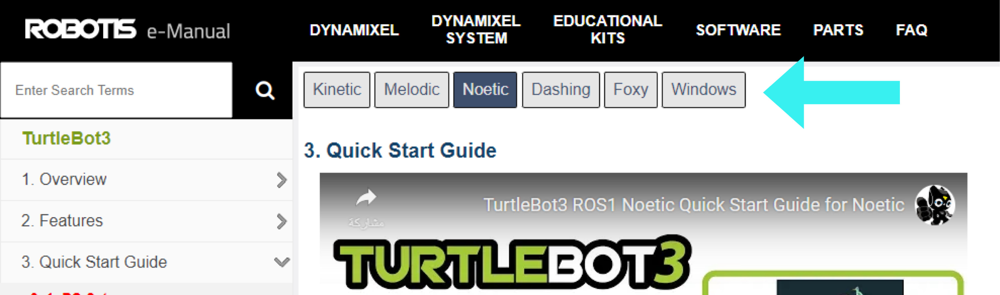
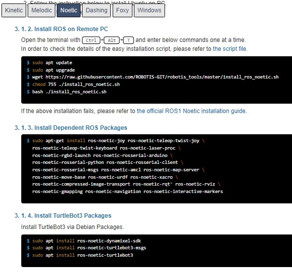
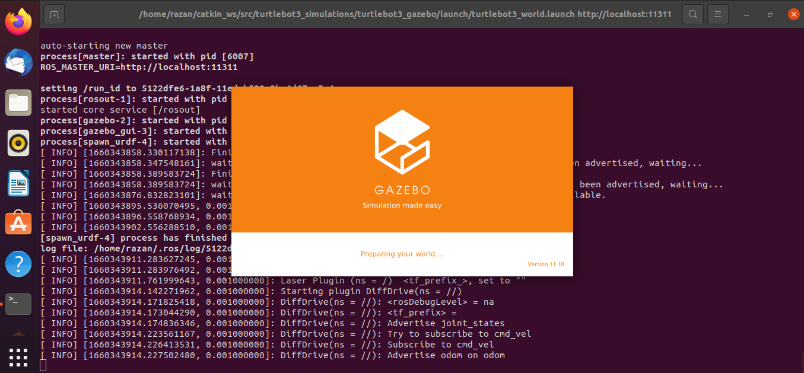
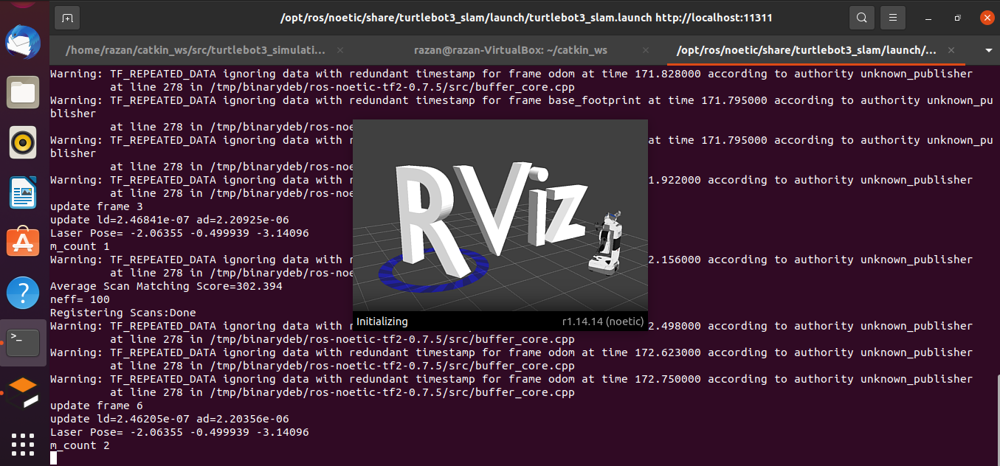
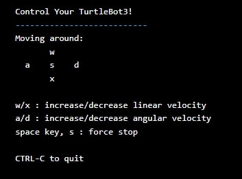

#### SLAM (Simultaneous Localization and Mapping) is a technique used to create and build a map for a telecontrol of the robotics. 

In order to do that you need to download the turtlebot packages and follow some steps: 

#### 1 - Go to https://emanual.robotis.com/docs/en/platform/turtlebot3/quick-start/ 

Choose your ROS version first. 

#### 2 - Now open your terminal and write the following commands in order (in case you are using ROS noetic). 

#### 1 - Install ROS on Remote PC and write the follwoing commands: 
- $ sudo apt update
- $ sudo apt upgrade
- $ wget https://raw.githubusercontent.com/ROBOTIS-GIT/robotis_tools/master/install_ros_noetic.sh
- $ chmod 755 ./install_ros_noetic.sh 
- $ bash ./install_ros_noetic.sh

#### 2 - Install Dependent ROS Packages: 
- $ sudo apt-get install ros-noetic-joy ros-noetic-teleop-twist-joy \
  ros-noetic-teleop-twist-keyboard ros-noetic-laser-proc \
  ros-noetic-rgbd-launch ros-noetic-rosserial-arduino \
  ros-noetic-rosserial-python ros-noetic-rosserial-client \
  ros-noetic-rosserial-msgs ros-noetic-amcl ros-noetic-map-server \
  ros-noetic-move-base ros-noetic-urdf ros-noetic-xacro \
  ros-noetic-compressed-image-transport ros-noetic-rqt* ros-noetic-rviz \
  ros-noetic-gmapping ros-noetic-navigation ros-noetic-interactive-markers

* Note: The above command is one full command, so copy the entire lines. 

#### 3 - Install TurtleBot3 Packages: 
- $ sudo apt install ros-noetic-dynamixel-sdk
- $ sudo apt install ros-noetic-turtlebot3-msgs
- $ sudo apt install ros-noetic-turtlebot3 

For the simulation packages go to: https://emanual.robotis.com/docs/en/platform/turtlebot3/simulation/ and write the commands in order. 

#### 1 - Install Simulation Package:
- $ cd ~/catkin_ws/src/
- $ git clone -b noetic-devel https://github.com/ROBOTIS-GIT/turtlebot3_simulations.git
- $ cd ~/catkin_ws && catkin_make 

#### 2 - Launch Simulation World: 

There are 3 simulation environments and different models for TurtleBot3. Select one to launch gazebo and write its commands in a new terminal. 

###### Empty Wrold: 
- $ export TURTLEBOT3_MODEL=burger
- $ roslaunch turtlebot3_gazebo turtlebot3_empty_world.launch 

###### TurtleBot3 World 
- $ export TURTLEBOT3_MODEL=waffle
- $ roslaunch turtlebot3_gazebo turtlebot3_world.launch 

###### TurtleBot3 House
- $ export TURTLEBOT3_MODEL=waffle_pi
- $ roslaunch turtlebot3_gazebo turtlebot3_house.launch 

#### Now gazebo will open. 

To run SLAM node, go to the website: https://emanual.robotis.com/docs/en/platform/turtlebot3/slam/ 

Open a new terminal tab and paste the following commands: 

- $ export TURTLEBOT3_MODEL=waffle (change waffle to the model you are using, either burger or waffle_pi)
- $ roslaunch turtlebot3_slam turtlebot3_slam.launch

#### Now Rviz will open. 

Now to run the teleoperation node and control the movement of your robot model, open a new terminal tab and paste: 
- $ export TURTLEBOT3_MODEL=burger
- $ roslaunch turtlebot3_teleop turtlebot3_teleop_key.launch 

Set of instruction will appear on the screen. 

 

##### Now you can control the movements of your robot miles away. 
